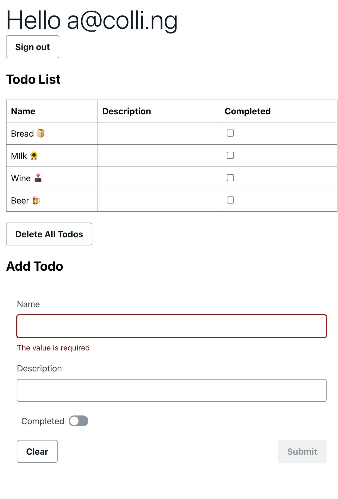

# TodoList 
An experiment using gpt-engineer to write the UI code for a web app. It should be done in GraphQL. TODO: update the prompt to see if gpt-engnieer can refactor the graphql in :)

* Created using Amplify CLI and studio
* Users can have individual logins using Cognito
* Some code written by gpt-engineer
* Emojis appended (WIP)

